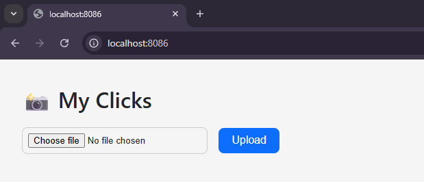
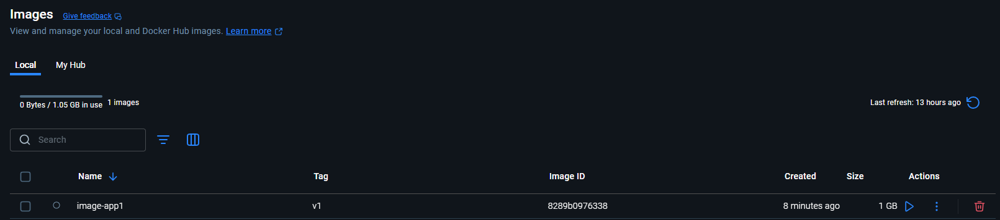
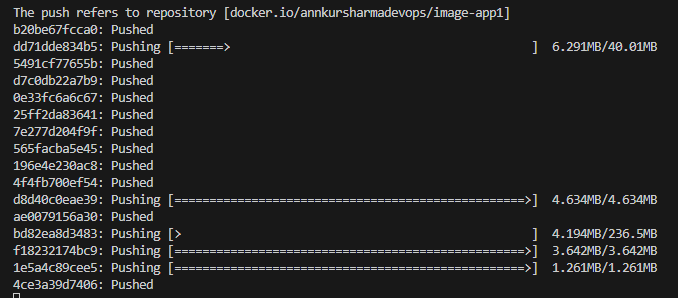

# 📸 My Clicks

A minimal photo gallery web app built with **Next.js**, **TypeScript**, and **Docker**. It allows image uploads (up to 5), auto-deletes the oldest photo when a new one is uploaded, and supports volume-mounting for persistent storage.

**This repo and application can be used on Docker Hub, Docker Repo, Kubernetes Cluster.**

 <!-- Optional screenshot -->
---
## ✨ Features

- 🔼 Upload image files (JPG, PNG, GIF, WEBP)
- 🧼 Auto-delete oldest image when upload limit (5) is reached
- 🚀 Instant auto-refresh after upload
- 🔐 User can upload; all photos are publicly viewable
- 🐳 Dockerized setup for consistent deployment
- 📁 File names are saved as: `photo-YYYYMMDDHHMM-<random>.ext`
---
## 🛠️ Tech Stack

- **Next.js** (App Directory + SSR)
- **TypeScript**
- **Node.js**
- **Formidable** (file parsing)
- **Docker + Docker Compose**
- **Custom Express server for image serving**
---
## 🚀 Quick Start (Local)

**Clone the repo:**
```bash
git clone https://github.com/annkur-sharma-devops/my-clicks.git
cd my-clicks
```
---
## 🐳 Docker Desktop

**Build and run using Docker Desktop:**
```bash
# Build docker image
docker build -t image-app1:v1 .

# Run docker image to a container
docker run -d -p 8086:3000 image-app1:v1
```

Image created on Docker Desktop.


**Access the application**

- **http://localhost:8086**
- **http://<VM_IP>:8086**

Image created on Docker Desktop.


---
## 🐳 Docker Hub

**Build and run using Docker Hub Public Repo:**
```bash
# Login into docker hub
docker login

# Build docker image
docker build -t image-app1:v1 .

# Add docker tag using Docker Hub Username and Image
docker tag image-app1:v1 annkursharmadevops/image-app1:v1

# Push the image to Docker Hub. It will go into the Docker Hub Repo. Now it can be pulled by docker commands.
docker push annkursharmadevops/image-app1:v1

# Run docker image to a container
docker run -d -p 8086:3000 image-app1:v1
```

Image created on Docker Hub.


---
## Access the application

- **http://localhost:8086**
- **http://<VM_IP>:8086**

Image created on Docker Desktop.


---
## 📦 Project Structure
```ruby
my-clicks/
├── components/
│   └── UploadForm.tsx
├── pages/
│   └── index.tsx
│   └── api/
│       └── upload.ts
├── public/
│   └── uploads/       # Uploaded files (mounted volume)
├── styles/
│   └── Home.module.css
│   └── globals.css
├── Dockerfile
├── docker-compose.yml
├── server.js          # Custom image server
└── README.md
```
---
## 📄 Upload API

- Endpoint: /api/upload
- Method: POST
- Payload: FormData with file field
- Response: JSON with upload status
---
## 💡 Future Enhancements

- 🌐 Add user authentication (for upload access)
- 🖼️ Add preview thumbnails
- 🔍 Add search/filter/tag support
- ☁️ Integrate with Azure Blob Storage or S3
- 📊 Add GoatCounter / Plausible analytics

---

## 👨‍💻 Author

Made by Annkur Sharma — feel free to ⭐ the repo or suggest improvements.
